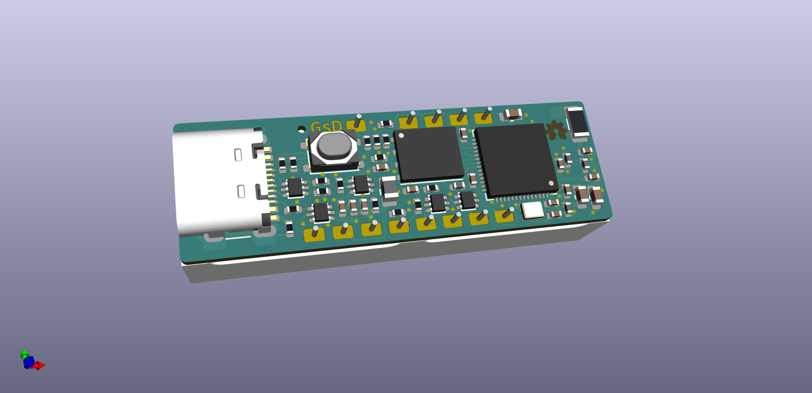
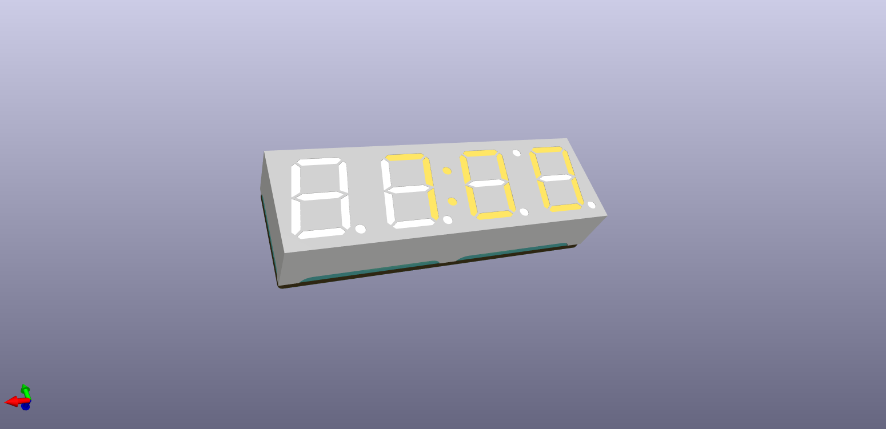

# Wizard Flute #

     ~ Current Status: Prototype boards ordered ~
     
     Note: This design was performed in KiCad nightly , you will need a Nightly build to open and edit these source files.

## What is it?

ESP32-S2 + LED Display

A Compact 4 digit 7-segment clock display with an ESP32-S2 control board.

It is powered off a USB-C connection on the side of the unit, and features 1 button.

This design will become a desk clock that sets it's time from your local WiFi using NTP.

## Licence
 * Hardware in this repository is licensed under CERN-OHL-P
